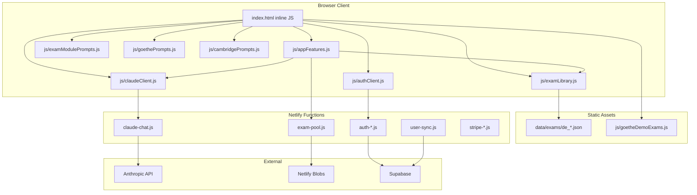
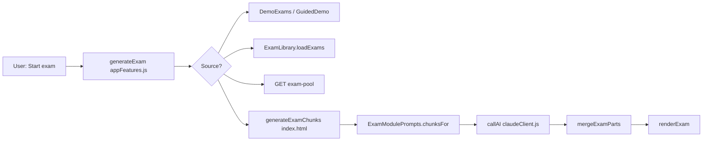
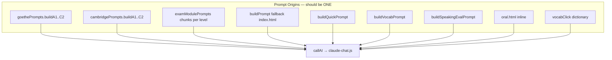
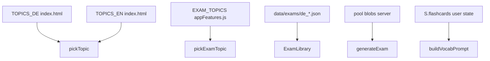
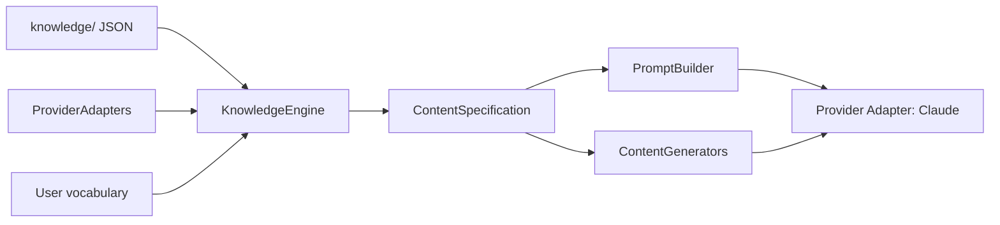

# LexiCoil — Dependency Graph (Current)

## High-level

## Exam generation dependency chain

## Prompt sources (duplication)

## Knowledge data flow (current — fragmented)

## Target dependency (for phase 02 reference)

